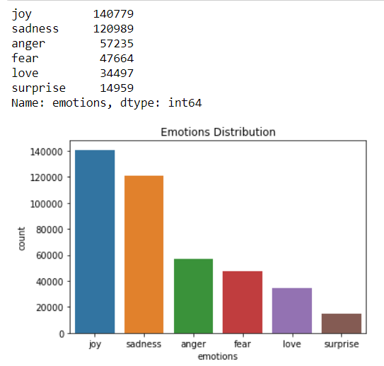
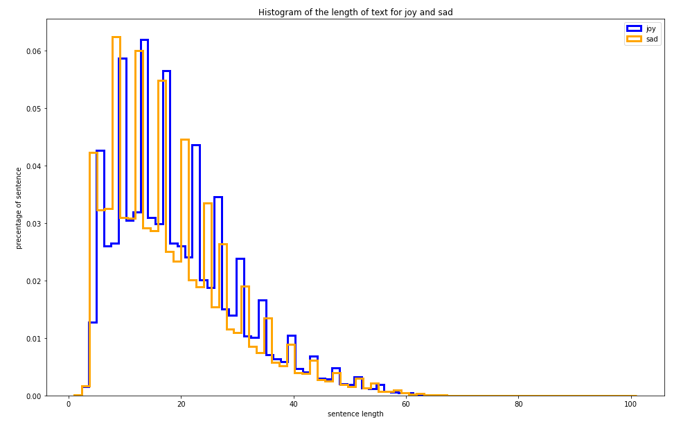
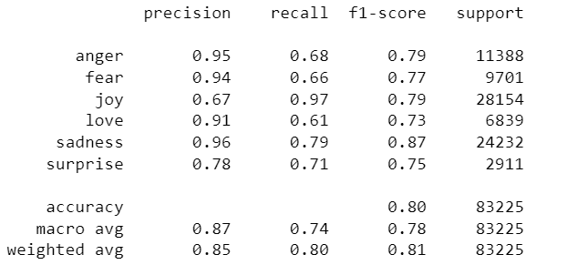
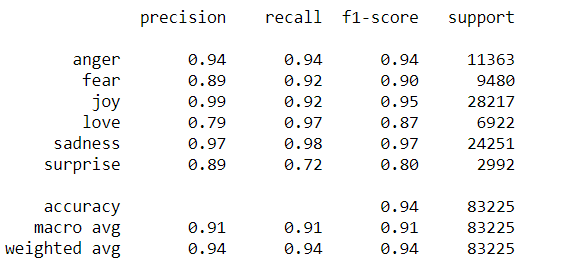

# Sentiment-Analysis-on-Tweets

## Abstract 
   Working with tweets dataset separated by feeling or expression
   (anger, fear, joy, love, sadness, surprise) that has two columns (text and emotions).
   Then doing some cleaning, visualization, exploratory, processing, modeling and interpreting .
    
    
## Cleaning 
   The dataset has no null values however it has 686 duplicate rows but other than that its pretty much clean but some of the tweets itself have a lot of unmeaningful context.
    
## Exploratory
 The majority class (joy) has over than 140 thousand sample in the other hand the minority class (surprise) has less than 15 thousand 
        sample so there is a clear indicator of an imbalanced data set here.  
     
         
       Most of the tweets lengths is between 5 to 25 words. Furthermore tweets lengths for each class are pretty much the same e.g. joy and sadness
         
         

## Modeling
#### XGboost
I started without balancing the dataset and with XGboost algorithm in learning it did good 
  
then I tried to balance the data with different techniques under sampling (random under-sampling, TomekLinks, ALKNN) then over sampling (random over-sampling, SMOTE) and combine
SMOTETomek.
#### LSTM
I started without balancing the dataset and with XGboost algorithm in learning it did good 
  
then I tried to balance the data with different techniques under sampling (random under-sampling) then over sampling (random over-sampling) and class weights by giving a higher weight for the minority class.
